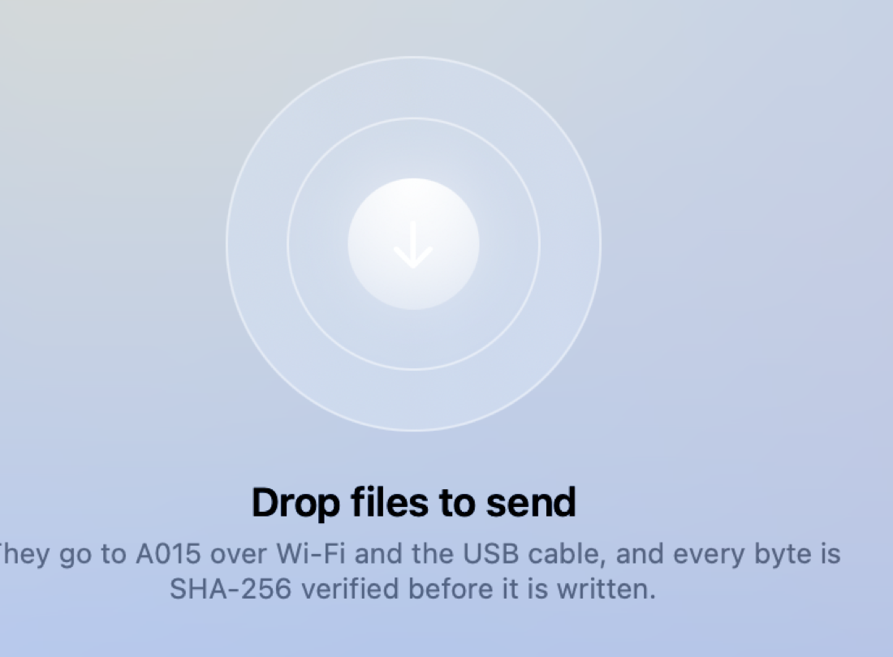
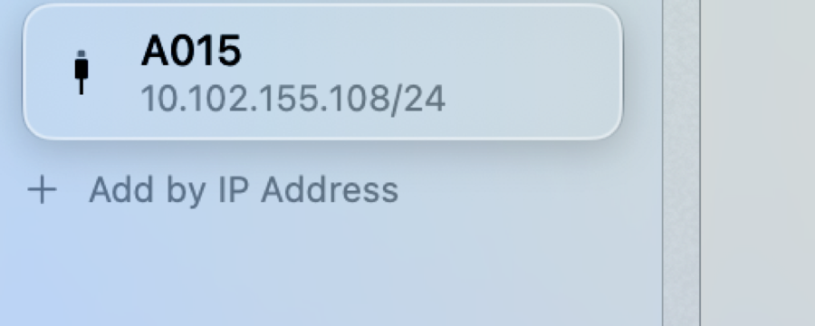
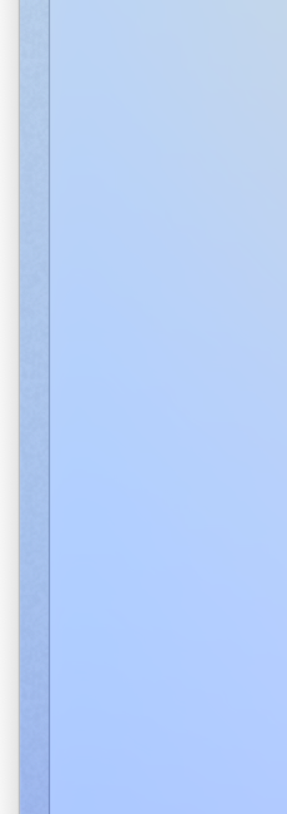

# HyperSend

<p align="center"></p>

A Mac app that sends files to Android over **Wi-Fi and the USB cable at the
same time**, and checks every byte with SHA-256. No accounts, no cloud, no
dependencies. The same engine ships as a CLI for Linux and Windows.

**Download:** [HyperSend.dmg from Releases](https://github.com/lakshyaverse/HyperSend/releases/latest)
— open it, drag the app to Applications, done. No Xcode, no terminal, no
dependencies.

<p align="center"></p>

### The glass, up close

<p align="center">
  
  
  
</p>

Real system Liquid Glass, not a blur imitation: the drop well is `.clear`
glass so the scene bends through it, the selected device sits on its own
floating lens, and every panel in the window shares one
`GlassEffectContainer` so neighbouring shapes lens as a group. Panels are
deliberately quiet (`.regular`), controls are the ones that glow
(`.interactive()`) — the division Apple's own guidance draws.

## How it works

A file is a list of 2 MiB chunks. The sender holds one offset queue with a
worker per data socket — whichever lane finishes its chunk first asks for the
next one. The receiver writes every chunk at its absolute file offset, so
chunk order and lane provenance do not matter. Adding a lane is adding a
socket; **losing** a lane is just a slower send — a path that won't open is
logged and skipped, never fatal.

### Trust model

Everything on the wire — beacons, control frames, file bytes — is plaintext,
by design: on a LAN you already trust the network you joined. That also means
there is **no authentication**: any host on the same network can impersonate a
receiver, inject beacons, or push files to a receiver that accepts
automatically. If that is not acceptable on your network, turn automatic
acceptance off (the Mac asks per file; decline anything you didn't ask for),
or don't run HyperSend on untrusted networks. There is no cloud and nothing
ever leaves the LAN — but the LAN itself is the security boundary.

The USB lane shouldn't work, and works anyway: phone tethering speaks RNDIS,
which macOS has no driver for, so the cable never appears as a network
interface. It doesn't have to. The receiver binds a fixed data port, and
`adb forward tcp:44013 tcp:44012` turns the cable into a plain TCP tunnel.
Two ports, deliberately distinct, so one Mac can send over the cable while
still receiving on the same port.

## Numbers

Developer's machine, Apple Silicon Mac to a CMF Phone 1 over a 480 Mbps
hotspot, 314.6 MB file:

| Path | Bytes | Throughput |
|---|---:|---:|
| Wi-Fi | 165.7 MB | 36.2 MB/s |
| USB cable | 148.9 MB | 32.6 MB/s |
| **Both bonded** | **314.6 MB in 4.6 s** | **68.8 MB/s** |

Back-to-back runs land in the 67-69 MB/s band. The result was pulled back off
the phone and `cmp`-ed against the original: identical.

Worth knowing what this isn't: no software beats the radio. The "240 MB/s
over Wi-Fi" claims you see are Wi-Fi 6E PHY marketing. Bonding two independent
paths is the only real win available, and it is the whole app.

## What's tested

`mac/test.sh` runs the end-to-end suite over real loopback TCP, no mocks (the
count is printed by the run itself — it grows as behavior gets pinned). The
Node engine carries its own suite (`npm test`) and CI runs it on
Ubuntu, Windows and macOS on every push.
multipath splitting, SHA-256 verification, resume (a matching file moves zero
bytes, a prefix moves only the rest), out-of-order interleaved chunks, batch
sends, back-to-back sessions, lane-loss degradation, same-name collisions, and
rejection of path traversal.

## Build

Only if you want to touch the code. Otherwise, take the DMG from Releases.
Open `mac/HyperSend.xcodeproj` in Xcode, or use the script, which builds the
same project with `xcodebuild`:

```bash
cd mac
./build.sh run      # build and launch
./build.sh dmg      # build, then package HyperSend.dmg
./test.sh           # the full end-to-end suite
```

The app is built with the hardened runtime and ad-hoc signed. Distributed as a
DMG: open it, drag HyperSend to Applications.

Command line, same binary:

```bash
HyperSend.app/Contents/MacOS/HyperSend --send big.zip --to 10.0.0.5 --usb
HyperSend.app/Contents/MacOS/HyperSend --receive ~/Downloads/HyperSend
```

The Android receiver is a single toggle: install the debug APK
(`android/`, plain Kotlin, zero dependencies), start it, files land in
`Download/HyperSend`.

The window uses Apple's Liquid Glass on macOS 26+, and standard materials on
earlier systems. Same layout either way.

## Linux and Windows

The CLI is the same engine, same protocol, same logic — no port, no fork.
It needs Node 20 or newer and nothing else:

```bash
git clone https://github.com/lakshyaverse/HyperSend.git
cd HyperSend
npm install && npm run build
```

Receive (the destination folder is created if missing):

```bash
./bin/hypersend receive ~/Downloads/HyperSend        # Linux/macOS
bin\hypersend.cmd receive %USERPROFILE%\Downloads\HyperSend   # Windows
```

Send, discover, bench — all the same commands as the Mac CLI binary:

```bash
./bin/hypersend send big.zip --to 10.0.0.5
./bin/hypersend send big.zip                       # auto-discovers the receiver
```

The USB lane is simpler than on the Mac: Linux and Windows ship the tether
drivers macOS lacks, so a cabled phone usually shows up as a plain network
interface and the cable is just a second path — no `adb forward` needed. When
a driver is missing anyway, the tunnel works exactly as documented above.

## Code

```
mac/Sources/Engine/     protocol, discovery, adb bridge, sender, receiver
mac/Sources/UI/         the window (SwiftUI, tokens in Tokens.swift)
mac/Tests/              the end-to-end suite
android/                Kotlin connector: receiver AND sender, the phone is a peer
src/                    Node engine: the protocol definition, Linux/Windows CLI
```

## Sponsors

HyperSend is supported by **BMS**. Their backing keeps the project free, MIT,
and free of dependencies — and keeps real hardware on the far end of every
two-lane benchmark in [Numbers](#numbers).

If your organisation would like to sponsor HyperSend, open an issue titled
"sponsorship" or reach out to [@lakshyaverse](https://github.com/lakshyaverse).

## Contributing

Read [CONTRIBUTING.md](CONTRIBUTING.md). The short version: the wire protocol
is shared by three implementations, so protocol changes land in all three at
once, and the engine is small enough to read in an afternoon. Start with
`mac/test.sh`.

## License

MIT.

---

<p align="center">Made with :heart: by <a href="https://github.com/lakshyaverse">Lakshya</a></p>
