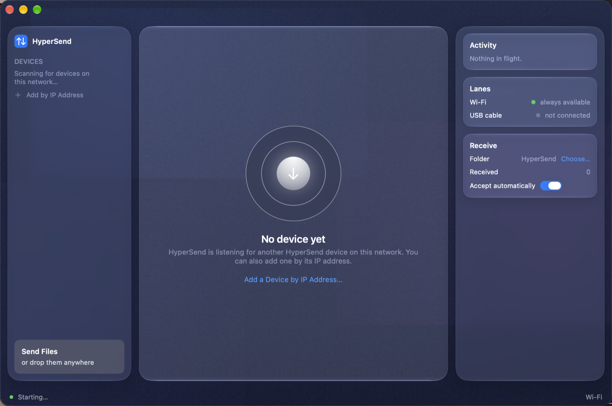

# HyperSend

<p align="center"></p>

A Mac app that sends files to Android over **Wi-Fi and the USB cable at the
same time**, and checks every byte with SHA-256. No accounts, no cloud, no
dependencies.

**Download:** [HyperSend.dmg from Releases](https://github.com/lakshyaverse/HyperSend/releases/latest)
— open it, drag the app to Applications, done. No Xcode, no terminal, no
dependencies.

<p align="center"></p>

## How it works

A file is a list of 2 MiB chunks. The sender holds one offset queue with a
worker per data socket — whichever lane finishes its chunk first asks for the
next one. The receiver writes every chunk at its absolute file offset, so
chunk order and lane provenance do not matter. Adding a lane is adding a
socket.

The USB lane shouldn't work, and works anyway: phone tethering speaks RNDIS,
which macOS has no driver for, so the cable never appears as a network
interface. It doesn't have to. The receiver binds a fixed data port, and
`adb forward tcp:44013 tcp:44012` turns the cable into a plain TCP tunnel.
Two ports, deliberately distinct, so one Mac can send over the cable while
still receiving on the same port.

## Numbers

Developer's machine, Apple Silicon Mac to a CMF Phone 1 over a 480 Mbps
hotspot, 314.6 MB file:

| Path | Bytes | Throughput |
|---|---:|---:|
| Wi-Fi | 165.7 MB | 36.2 MB/s |
| USB cable | 148.9 MB | 32.6 MB/s |
| **Both bonded** | **314.6 MB in 4.6 s** | **68.8 MB/s** |

Back-to-back runs land in the 67-69 MB/s band. The result was pulled back off
the phone and `cmp`-ed against the original: identical.

Worth knowing what this isn't: no software beats the radio. The "240 MB/s
over Wi-Fi" claims you see are Wi-Fi 6E PHY marketing. Bonding two independent
paths is the only real win available, and it is the whole app.

## What's tested

`mac/test.sh` runs 42 end-to-end checks over real loopback TCP, no mocks:
multipath splitting, SHA-256 verification, resume (a matching file moves zero
bytes, a prefix moves only the rest), out-of-order interleaved chunks, batch
sends, back-to-back sessions, and rejection of path traversal.

## Build

Only if you want to touch the code. Otherwise, take the DMG from Releases.
Open `mac/HyperSend.xcodeproj` in Xcode, or use the script, which builds the
same project with `xcodebuild`:

```bash
cd mac
./build.sh run      # build and launch
./build.sh dmg      # build, then package HyperSend.dmg
./test.sh           # 42/42 checks
```

The app is built with the hardened runtime and ad-hoc signed. Distributed as a
DMG: open it, drag HyperSend to Applications.

Command line, same binary:

```bash
HyperSend.app/Contents/MacOS/HyperSend --send big.zip --to 10.0.0.5 --usb
HyperSend.app/Contents/MacOS/HyperSend --receive ~/Downloads/HyperSend
```

The Android receiver is a single toggle: install the debug APK
(`android/`, plain Kotlin, zero dependencies), start it, files land in
`Download/HyperSend`.

The window uses Apple's Liquid Glass on macOS 26+, and standard materials on
earlier systems. Same layout either way.

## Code

```
mac/Sources/Engine/     protocol, discovery, adb bridge, sender, receiver
mac/Sources/UI/         the window (SwiftUI, tokens in Tokens.swift)
mac/Tests/              the 42-check end-to-end suite
android/                Kotlin receiver
src/                    Node reference engine: the protocol definition
```

## Contributing

Read [CONTRIBUTING.md](CONTRIBUTING.md). The short version: the wire protocol
is shared by three implementations, so protocol changes land in all three at
once, and the engine is small enough to read in an afternoon. Start with
`mac/test.sh`.

## License

MIT.

---

<p align="center">Made with :heart: by <a href="https://github.com/lakshyaverse">Lakshya</a></p>
