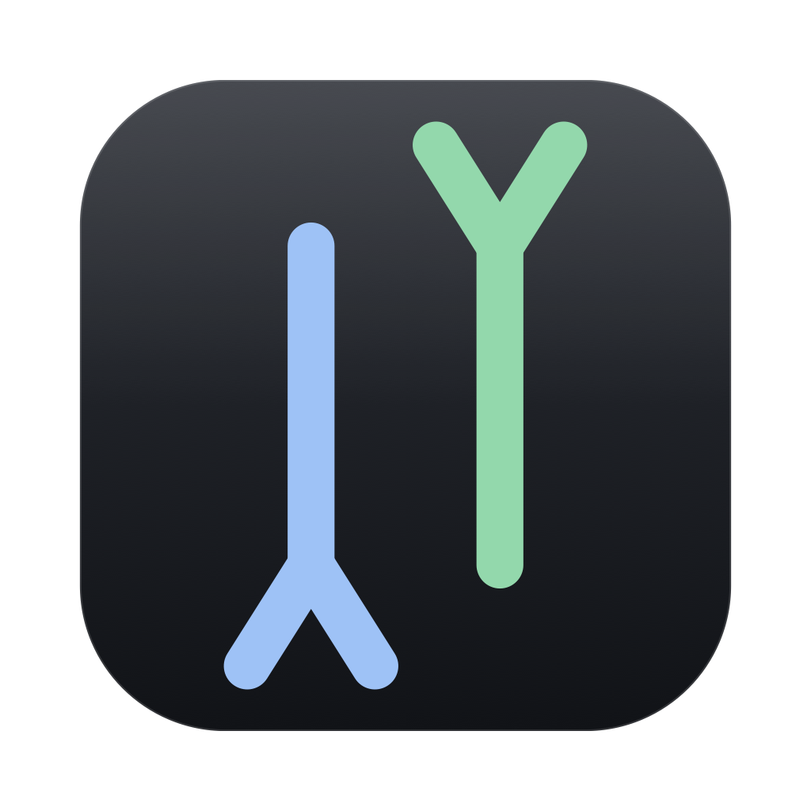

<p align="center">
  
</p>

<h1 align="center">HyperSend</h1>

<p align="center">
  <strong>Every lane at once.</strong><br/>
  Wi-Fi <i>and</i> the USB cable, bonded into one transfer — SHA-256 verified, byte for byte.<br/>
  No accounts. No cloud. No dependencies.
</p>

<p align="center">
  <a href="LICENSE"></a>
  
  
  
  <a href="https://github.com/lakshyaverse/HyperSend/issues"></a>
</p>

<p align="center">
  
</p>

---

## The idea

LocalSend-class tools pick one network interface and send over it. HyperSend treats
each interface as a **lane** and runs them in parallel into the same receiver:

```
                     ┌──────────── Wi-Fi (TCP :44012) ────────────┐
  Mac sender ────────┤                                             ├────► Android receiver
  (one offset queue) └── USB cable (TCP :44013 → adb → :44012) ────┘        (writes by offset)
```

A file is a list of fixed-size 2 MiB chunks. The sender keeps **one shared offset
queue** and one worker per data socket: whichever lane finishes its chunk first asks
for the next one. There is no bandwidth probing, no statistical scheduler, and no
reordering logic — the receiver writes every chunk at its own **absolute file offset**,
so chunk order and provenance are irrelevant. Adding a lane is adding a socket.

## Performance

Measured on the developer's machine (Apple Silicon Mac → CMF Phone 1, 314.6 MB file):

| Path | Bytes | Throughput |
|---|---:|---:|
| Wi-Fi (hotspot PHY ceiling 480 Mbps) | 165.7 MB | 36.2 MB/s |
| USB cable (adb tunnel, USB 2.0) | 148.9 MB | 32.6 MB/s |
| **Bonded** | **314.6 MB in 4.6 s** | **68.8 MB/s** |

Back-to-back runs land in the 67–69 MB/s band. The result was pulled back off the
phone and `cmp`-ed: byte-for-byte identical, SHA-256 `4035caf7…0c6a`. Consecutive
transfers need no restart — four sessions ran in a row.

## The USB lane (the part that shouldn't work)

Phone USB tethering speaks **RNDIS**, which macOS has no driver for — so the cable can
never show up as a network interface. It turns out it doesn't have to. The receiver
binds a **fixed** data port, and `adb forward tcp:44013 tcp:44012` turns the cable into
a plain TCP tunnel that needs no kernel driver at all. Two ports, deliberately distinct,
so one Mac can *send* over the cable while still *receiving* on the same fixed port.

## Honest engineering position

Most "240 MB/s over Wi-Fi" claims are marketing:

- **The radio is the bottleneck.** 240 MB/s needs a Wi-Fi 6E 160 MHz 2×2 link in ideal
  conditions. No software exceeds the PHY. Here the hotspot is 480 Mbps, so ~30 MB/s
  per radio path is the honest ceiling — which is exactly why bonding *two independent
  paths* is the only real win available.
- **`mmap` is not network zero-copy** — it removes disk-side copies, nothing more.
- **16 MB TCP buffers are pointless on a LAN**: the bandwidth-delay product at 1 ms RTT
  is ~250 KB per Gbps.
- **`O_DIRECT` does not bypass Android's FUSE layer** for app storage.

What actually helps: a raw unframed data plane (framing only on the tiny JSON control
channel), `TCP_NODELAY`, bounded backpressure, and optional resume that sends only the
missing bytes.

## Verified behaviour

- **Multipath** — chunks split across N sockets on N paths; lane byte counts always sum
  to the file size.
- **Byte-exact** — receiver hashes the whole file on disk before answering; a mismatch is
  discarded, never delivered.
- **Resume** — a file whose size *and* hash match is skipped (0 bytes moved); a prefix is
  reused (only missing bytes cross the wire).
- **Streaming multipath by offset** — chunks arrive out of order, interleaved across
  sockets, and still land correctly.
- **Batch sends** — many files in one session reuse a single socket pool.
- **Back-to-back sessions** — the receiver keeps its data listener for a whole
  session and releases it cleanly, so transfers run one after another without an
  app restart.
- **Path-traversal hardened** — `../`, absolute paths, empty segments and backslashes are
  all rejected.

`mac/test.sh` runs 42 end-to-end checks over real loopback TCP — no mocks — in one
process. Bisect knobs: `HS_TEST_LANES=1 HS_TEST_SOCKETS=1 ./test.sh`.

## Build & run

### macOS app

Native AppKit + SwiftUI, zero dependencies, built with the Xcode toolchain
(`xcrun swiftc` — no Xcode project required):

```bash
cd mac
./build.sh          # → HyperSend.app (Liquid Glass UI, macOS 26+)
./build.sh run      # build and launch
./build.sh dmg      # build, then package HyperSend.dmg
./test.sh           # 42/42 end-to-end checks
```

Headless and scriptable:

```bash
HyperSend.app/Contents/MacOS/HyperSend --send big.zip --to 10.0.0.5            # one lane
HyperSend.app/Contents/MacOS/HyperSend --send big.zip --to 10.0.0.5 \
    --usb --usb-port 44013                                                     # add the cable
HyperSend.app/Contents/MacOS/HyperSend --receive ~/Downloads/HyperSend
```

The UI is real Apple **Liquid Glass** (`glassEffect`) on macOS 26+ and frosted
system materials on earlier releases — same layout, same behaviour either way.

### Android receiver

```bash
cd android && gradle :app:assembleDebug
adb install -r app/build/outputs/apk/debug/app-debug.apk
adb shell "su -c 'am start -n com.hypersend.app/.MainActivity'"   # starts the receiver service
```

The UI is a single toggle. Files land in `Download/HyperSend`.

## Layout

```
mac/                    Native macOS app (the flagship)
  Sources/Model.swift     App state: peers, transfers, lanes, logs, USB probe
  Sources/UI/             Liquid Glass window: sidebar, drop well, inspector
  Sources/Engine/         Protocol, discovery, adb bridge, sender, receiver
  Tests/                  End-to-end engine tests (42 checks)
  build.sh  test.sh

android/app/            Kotlin receiver (zero dependencies)
  Protocol.kt             Wire protocol + session-scoped multipath receiver
  ReceiveService.kt       Foreground service
  MainActivity.kt         Toggle UI

src/                    Node reference engine and test oracle (v1) — the protocol
                        definition the Swift and Kotlin implementations match.
```

## Protocol (v2)

| Channel | Port | Framing |
|---|---|---|
| Control | TCP `:44010` | `[4-byte BE length][JSON]` — `hello` → `ready` → `offer` → `offer-response` → `file-sent` → `file-done` → `batch-done` |
| Data | TCP `:44012` (fixed) | `[4-byte BE length][1-byte flags][8-byte BE offset][payload]` — 13-byte header, length field = 9 + payload |
| Discovery | UDP `:44011` | a JSON beacon every 500 ms; no mDNS daemon to go flaky |

## Contributing

Issues and pull requests welcome — see [CONTRIBUTING.md](CONTRIBUTING.md). Good first
issues are labelled. The engine is small enough to read in an afternoon; the test suite
is the fastest way in.

## License

[MIT](LICENSE) — do anything, just keep the notice.
